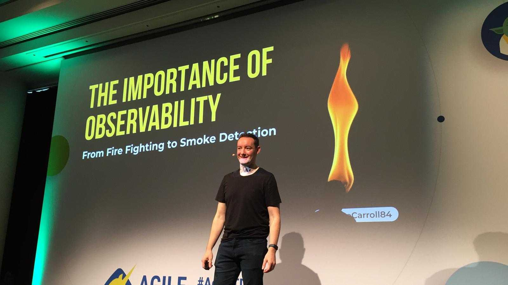
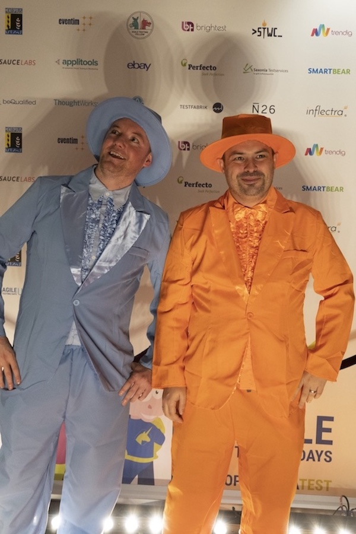
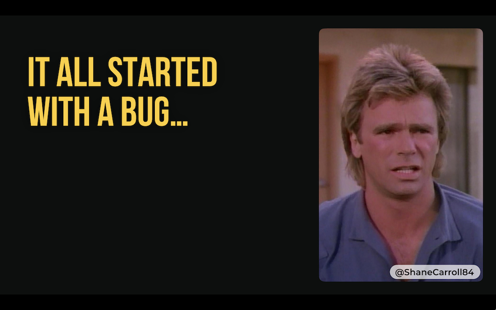
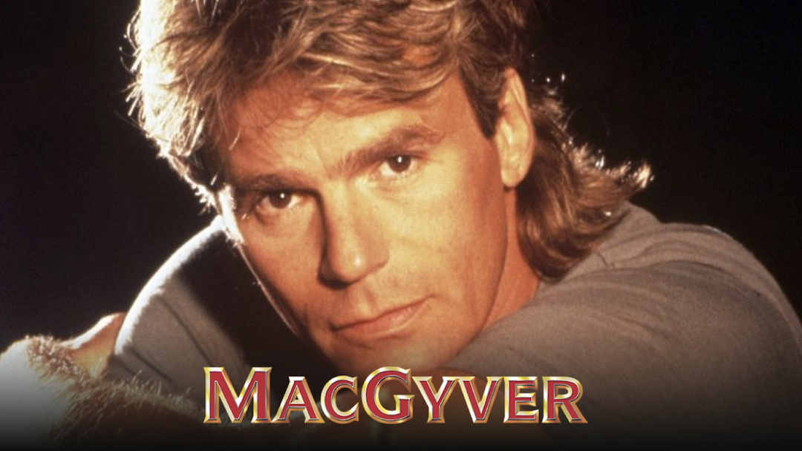
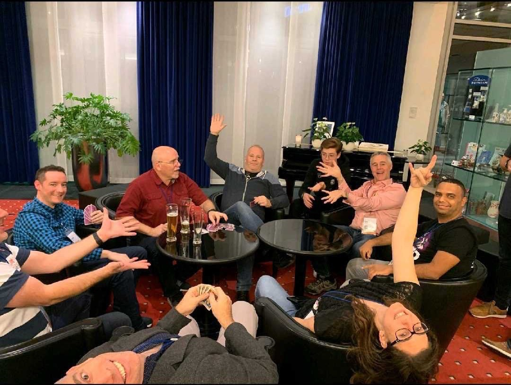

Agile Testing Days is without doubt my favourite conference each year. The 2019 edition was a massive one for me as although it was my third time attending it was my first one as a speaker, In fact it was my first time speaking at any conference. 
So how did this happen?

## _Let’s jump back in time for a moment to Agile Testing Days 2018_

Me (_Harry_) and Rob (_Lloyd_) decided during this conference that the following year we wanted to return as speakers. Rob had just given a lightning talk on Testability. I hadn’t even spoken at a meet-up yet so decided trying to complete a lightning talk next year would be a realistic goal.

## _Now all I needed was a story.._

As I say in one of my slides it all started with a bug! Shortly before this conference happened our team got hit with a major bug. This was followed by some learning reviews, new tools and processes put in place, and significant changes to how our team worked.

## _This is beginning to sound like a good story right?_

The company I work for, Poppulo host regular Show and Tells, Demos and Lightning Talks within the Engineering department. I gave a short presentation demonstrating some of the improvements we had made, and with that my first steps into public speaking had begun.

<blockquote class="twitter-tweet">
<a href="https://twitter.com/ShaneCarroll84?ref_src=twsrc%5Etfw">@ShaneCarroll84</a> talking about how the team are now using sentry to capture clientside exceptions which has added huge visibility into where issues are being introduced <a href="https://twitter.com/PoppuloTech?ref_src=twsrc%5Etfw">@PoppuloTech</a> <a href="https://t.co/kkZp3IQvvq">pic.twitter.com/kkZp3IQvvq</a>
&mdash; Sponge Bob Test Pants (@RobMeaney) <a href="https://twitter.com/RobMeaney/status/1000013708314271746?ref_src=twsrc%5Etfw">May 25, 2018</a></blockquote>

## _Where To Next?_

Luckily for me Cork has an excellent ministry of testing <a href="https://www.meetup.com/Ministry-of-Testing-Cork/">meet-up</a>.
 Also _luckily_ for me they were looking for some new speakers at that time. _Luckily_ again I happen to work with the two co-founders of the meet-up - <a href="https://twitter.com/RobMeaney">Rob</a> and <a href="https://twitter.com/conorfi">Conor</a> who encouraged me to tell my story there.

In hindsight, looking at how all these events happened together reminds me of Stephan Kämpers "Being Lucky" keynote from last years Agile Testing Days. I was helping myself to be luckier!

<blockquote class="twitter-tweet">
The (to be repeated) question for the week:   What are you trying this week to be luckier?<a href="https://twitter.com/hashtag/BeingLucky?src=hash&amp;ref_src=twsrc%5Etfw">#BeingLucky</a> <a href="https://t.co/b9tfFQxjmE">pic.twitter.com/b9tfFQxjmE</a>
&mdash; Stephan Kämper (@S_2K) <a href="https://twitter.com/S_2K/status/1200035016962707456?ref_src=twsrc%5Etfw">November 28, 2019</a></blockquote> 

Now I had to expand on what was just a short ten minute talk and also put some structure around it. It was pretty easy to flesh out as the story was evolving at the same time. 

Our team was rapidly making improvements to our monitoring and observability and putting into practise some of the outcomes of our learning review.
Conor has a lot of experience with public speaking and toastmasters and was great at giving tips and feedback to improve the talk.

## _What's In A Name?_

It needed a catchy title. We brainstormed and __“Observability - From Fire Fighting to Smoke Detection”__ was born! Rob is taking credit for the title but that's something he would do anyway :stuck_out_tongue: 

The timing of this coincided with the deadline of the call for papers for Agile Testing Days 2019. I tried to distill my talk into an abstract and some key takeaways, submit and hopefully get that lightning talk in Potsdam!

<blockquote class="twitter-tweet">
The April Meetup of <a href="https://twitter.com/ministryoftest?ref_src=twsrc%5Etfw">@ministryoftest</a> Cork has kicked off.<a href="https://twitter.com/ShaneCarroll84?ref_src=twsrc%5Etfw">@ShaneCarroll84</a> delivering a talk on Observability. <a href="https://t.co/xDPqpolQsO">pic.twitter.com/xDPqpolQsO</a>
&mdash; MinistryofTestCork (@MinistryCork) <a href="https://twitter.com/MinistryCork/status/1116399896972746752?ref_src=twsrc%5Etfw">April 11, 2019</a></blockquote>

## _Best Laid Plans_

I was delighted with how the Ministry of Test meet-up went. I felt pretty nervous beforehand and starting off but it's a really friendly crowd there and a great venue to present for the first time at. The feedback was that I appeared calm when I was speaking so that was a relief as I didn't feel that way. 
Before-hand I had some practise runs with our test team and a transatlantic call with my American tester friends, Shout-out to <a href="https://twitter.com/Mondazzle87">Jen</a> and <a href="https://twitter.com/mandabakah">Amanda</a>!

A few weeks later I got a huge shock. My submission was accepted for Agile Testing Days 2019, but not as a lightning talk, instead a full proper talk. **_This was not part of the plan!_**

## _Back To The Drawing Board_

Now I had a lot more preparation to do so naturally ~~I got to work on it straight away~~ procrastinated for several months.
Eventually I got around to it restyling the slides. This basically involved tearing them up and starting from scratch. Luckily (again) I work with an awesome designer <a href="https://twitter.com/edmundojr_">Edmundo</a> who was more than happy to help with this, check out his <a href="https://edmundojr.com/">blog</a>.

Our first conversation went something like this: 
**Me** “I need an image for this slide representing a usual daily stand up meeting, this is what I have at the moment” - _presents generic image of stand up meeting downloaded from the web_ 
**Ed** “If you use that image I'm never talking to you again.”

Clearly we had a good bit of work to do. I massively underestimated the amount of time spent preparing, slides, practising the talk and scouring the internet for suitable MacGyver images.

## _Get Feedback_

Once the slides were updated my next job was to practise it and gather feedback from some real humans and not just the voices in my head. This is where Jen and Amanda helped out again. They kindly volunteered to listen to my talk, **_“critique you and tear you down in detail”._**

My takeaways from the practise run were as follows:

* I needed to change my intro as it was too boring
* It’s tough to present over a video conference where you can’t see feedback from your audience
* Some of the slide designs still needed work
* I was so focused on trying to get through it all I forgot to inject any enthusiasm - **_Be less robotic!_**

Still it’s much better to find out these things with time to work on them I guess rather than the night before. I then had another practise run with the test team in the office. This should be getting easy now right.. yeah, it was a complete disaster!

Firstly the room equipment wasn’t working properly so I couldn’t see my speaker notes. I changed my intro just before the start, hadn’t time to practise it yet so ended up forgetting half of it. I also had updated the order of the slides and got a bit lost half way then just stumbled through the rest of it. Off to Germany I went on the back of this brimming with confidence! :sweat_smile:

##_Ich Bin Ein Potsdamer_

I arrived in Potsdam on Sunday so I had a couple of days to explore the town, relax and practise my talk some more. On Monday Stephan Kämper gave an inspiring keynote which I mentioned above. Another nugget I took from this was the advice that in general when you're presenting the audience wants you to succeed. It might seem obvious but it's still reassuring to hear this as a first time speaker.

<blockquote class="twitter-tweet">
If you&#39;re a first-time speaker at this conference, expect that your audience will like you, because they *want you to succeed*. Focus on the things you *can* do. You can&#39;t guarantee your laptop won&#39;t crash but you can be ready if it does. <a href="https://twitter.com/S_2K?ref_src=twsrc%5Etfw">@S_2K</a> <a href="https://twitter.com/hashtag/agiletd?src=hash&amp;ref_src=twsrc%5Etfw">#agiletd</a>
&mdash; lisacrispin (@lisacrispin) <a href="https://twitter.com/lisacrispin/status/1191405992933810177?ref_src=twsrc%5Etfw">November 4, 2019</a></blockquote> 

This was followed by attending the speakers dinner for my first time. It was great to meet some new people, some first timers like myself and enjoy all the great food and wine. We retired back to the Dorint afterwards and I ended up scooping during the Great Dalmuti, not for my first time.

##_Who needs a clicker anyway?_

The night before my talk I got approximately zero hours sleep just as I expected. I got the unexpected good news that the same talk had been accepted for ATD USA in June, but to be honest I couldn't really process that until I'd gotten through this conference first! 
I went down for breakfast in the hotel that morning and bumped into <a href="https://twitter.com/a_bangser">Abby Bangser</a> there. Abby had given an unbelievable keynote on Observability the previous day and passed on some really useful last minute speaker tips for which I was extremely grateful. 
I went back up to the room for a final practise run, then it was showtime! Once I was standing on stage ready to go I realised forgot to bring my clicker with me but sure no big deal, lucky they had a spare :smile:. Jen gave me the thumbs up and off I went! 

<blockquote class="twitter-tweet">
So unbelievable proud of my friend <a href="https://twitter.com/ShaneCarroll84?ref_src=twsrc%5Etfw">@ShaneCarroll84</a> for speaking at <a href="https://twitter.com/hashtag/agiletd?src=hash&amp;ref_src=twsrc%5Etfw">#agiletd</a> !! <a href="https://t.co/lBa7G3ThuE">pic.twitter.com/lBa7G3ThuE</a>
&mdash; Jen @ #agileTD (@Mondazzle87) <a href="https://twitter.com/Mondazzle87/status/1192384231831461888?ref_src=twsrc%5Etfw">November 7, 2019</a></blockquote>

<blockquote class="twitter-tweet">
Told you this was gonna be a good day at <a href="https://twitter.com/hashtag/AgileTD?src=hash&amp;ref_src=twsrc%5Etfw">#AgileTD</a>!  Next up is <a href="https://twitter.com/ShaneCarroll84?ref_src=twsrc%5Etfw">@ShaneCarroll84</a> with the importance of observability: from fire fighting to smoke detection  [Brilliant title!] <a href="https://t.co/pmmNj0YH24">pic.twitter.com/pmmNj0YH24</a>
&mdash; Abby Bangser (@a_bangser) <a href="https://twitter.com/a_bangser/status/1192383245738004480?ref_src=twsrc%5Etfw">November 7, 2019</a></blockquote>

<blockquote class="twitter-tweet">
Another great first voice talk about Observability by <a href="https://twitter.com/ShaneCarroll84?ref_src=twsrc%5Etfw">@ShaneCarroll84</a> . Ask the right questions! <a href="https://t.co/ZZc4zzKyBc">pic.twitter.com/ZZc4zzKyBc</a>
&mdash; Wedge_on_QA (@QaWedge) <a href="https://twitter.com/QaWedge/status/1192416672759631872?ref_src=twsrc%5Etfw">November 7, 2019</a></blockquote>

<blockquote class="twitter-tweet">
Great Talk by <a href="https://twitter.com/ShaneCarroll84?ref_src=twsrc%5Etfw">@ShaneCarroll84</a> on observability! Interesting stories and insights, and I loved the slide design. There can&#39;t be enough MacGyver Gifs :D <a href="https://twitter.com/hashtag/agileTD?src=hash&amp;ref_src=twsrc%5Etfw">#agileTD</a> <a href="https://t.co/qhTMaJZW8H">pic.twitter.com/qhTMaJZW8H</a>
&mdash; Virginia Weidhaas (@vweidhaas) <a href="https://twitter.com/vweidhaas/status/1192398273857888256?ref_src=twsrc%5Etfw">November 7, 2019</a></blockquote>

##_I Did It!_

Once I managed to get through the first few slides without freezing I actually loved every minute of it! My key takeaways from the whole first talk experience are as follows:

* Take notes, screenshots, photos when working on a problem or a new experience. This is not something you think of instinctively if you're in the middle of dealing with an issue but can make great aids for learning reviews or even future talks!
* Submit! - Everyone has a story and it will be interesting to someone! Don't be put off by impostor syndrome or feeling like you're not 'expert' enough on the subject. There's a great sense of achievement after giving a talk
* Prepare for the abstract as much as for the actual talk. Read and re-read what the conference are looking for in the submission. Get it reviewed from people who have submitted successfully before.
* Practise and get as much feedback as possible beforehand. Use local meet-ups, work colleagues, anyone who might be prepared to listen and offer advice!
* Remember just before speaking as Stephan said in his keynote - The audience wants you to succeed.

##_What Next.._

The main thing for me now is preparing to give this talk again in Chicago in June. I just got some feedback from the session ratings, so now I can incorporate that and make a few tweaks. 

Another outcome of the conference was that it inspired a few of us to start our own learning group. After seeing one in action and the benefits of setting goals and being held accountable to them, it seemed like a great idea. I might just post an article on that if it turns out to be successful! One of my goals for that group was actually to start a blog so I guess that means:

- [x] __Start a Blog__

My next goal is to get back speaking at Agile Testing Days 2020 so I'm already trying hard to think of a new subject to submit.
I will be writing a blog post on the content of my talk shortly but in the meantime you can find a link to my slides <a href="https://www.slideshare.net/ShaneCarroll10/observability-from-fire-fighting-to-smoke-detection-191809930">here</a>
<iframe src="//www.slideshare.net/slideshow/embed_code/key/xcQCRh54vyzPON" width="595" height="485" frameborder="0" marginwidth="0" marginheight="0" scrolling="no" style="border:1px solid #CCC; border-width:1px; margin-bottom:5px; max-width: 100%;" allowfullscreen> </iframe> 
 <strong> <a href="//www.slideshare.net/ShaneCarroll10/observability-from-fire-fighting-to-smoke-detection-191809930" title="Observability - From fire fighting to smoke detection" target="_blank">Observability - From fire fighting to smoke detection</a> </strong> from <strong><a href="//www.slideshare.net/ShaneCarroll10" target="_blank">Shane Carroll</a></strong> 

Wow that was a long blog post, I promise my next article won’t be as long!
