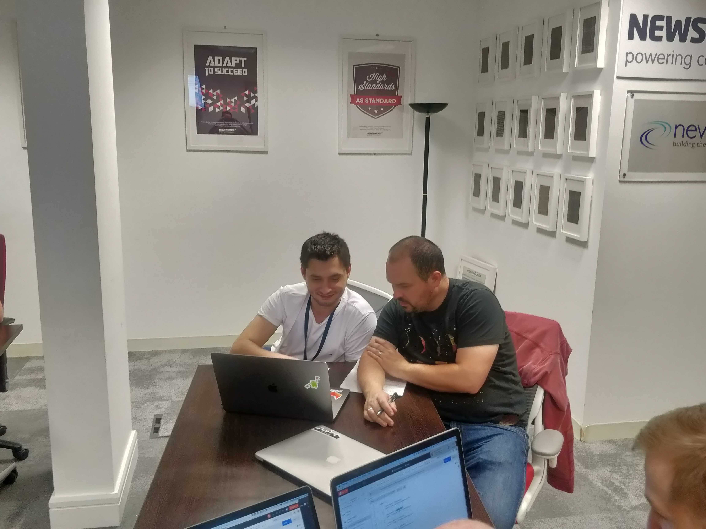

I first heard about bug bashes many years ago in Big Fish Games. I used them while working as a tester there to check new features and various changes to the website. Last November I ran one in Poppulo. So what made this one different?

The main difference was this didn’t involve a website, a new customer facing feature or in fact any UI at all. We were testing some new API endpoints for internal use only between teams. Would a bug bash work in this scenario?

## Why run a Bug Bash?
In general the reasons for running them are pretty straight forward. You have a new feature, you’ve tested it within your team but you want an extra layer of security some more eyes looking at it gives you. Ideally you get people from different roles and different areas of the business involved to look at some scenarios which testers or developers might not have considered.

In this case our team had developed and tested the endpoints but we wanted the consuming team and some other curious minded people to take a look and give us that extra bit of confidence prior to release.

## When to run them?
Usually they are run prior to release when the feature has been tested and is in a good state. In this instance we had no release date really as it wasn’t a customer facing feature. We were happy with the testing already done, and had some monitoring tools and swagger documentation in place. I then talked to the other team to find a time that suited them and set it up.

## Preparation is key
The first thing I did was talk to my colleague Conor to get a few tips. I highly recommend reading his <a href="https://conorfi.com/software-testing/guidelines-for-running-a-bug-bash/">blog post</a> blog post with guidelines on how to run a successful bug bash before starting.

I then spent time getting the following items ready:

* **Postman Collections** - I had these prepared for the different endpoints with successful and unsuccessful requests. The participants can then use them and just tweak the requests as they wish to explore when testing.
* **Test Data** - Test accounts were set up specifically for use during the bug bash.
* **Test Environment** - I made sure the test environment was stable during the scheduled time and no maintenance was happening or load tests were running.
* **Participant Instructions** - I created a Google Doc with Endpoint URLs, Test Account information, Links to Swagger API Documentation and Postman Collections.
* **Bug Location** - A shared drive and spreadsheet to log any issues found and accompanying screenshots or recordings.
* **Slack Channel** - I set up a slack channel and added all the participants for easy communication during the bug bash.

## Areas to focus on
Usually if you’re testing a website or an app you get the participants to focus on different user flows or areas of the site. Even though in this case we were testing an API there were still lots of different areas for people or groups to focus on. For example:

* **Performance**
* **Security**
* **Logging**
* **API Documentation**
* **Error codes and error messages returned**

## Paired Testing

<small><i>A Bulgarian and a Mexican working together</i></small>

I decided to group the participants into pairs for this bug bash. There was a couple of reasons for this:
<a href="https://twitter.com/gwendiagram">Gwen Diagram</a> had visited Poppulo a few weeks prior to this. She ran a workshop in the office ( Brilliantly titled ‘_**Never Eat Soggy Weetabix**_’ ) where we paired up and tested a mobile app. I thought this worked really well especially when people from different functions worked together. Eg. UI/UX, Site Reliability Engineers, Developers alongside testers.

<blockquote class="twitter-tweet">
<a href="https://twitter.com/gwendiagram?ref_src=twsrc%5Etfw">@gwendiagram</a> kicking off her talk here in <a href="https://twitter.com/PoppuloSays?ref_src=twsrc%5Etfw">@PoppuloSays</a> about <a href="https://twitter.com/hashtag/testing?src=hash&amp;ref_src=twsrc%5Etfw">#testing</a>. Delighted to see almost the entire engineering department here 😀 <a href="https://t.co/Dn1FagmYdI">pic.twitter.com/Dn1FagmYdI</a>
&mdash; Sponge Bob Test Pants (@RobMeaney) <a href="https://twitter.com/RobMeaney/status/1182613190594748417?ref_src=twsrc%5Etfw">October 11, 2019</a></blockquote>

Team A had developed the new API endpoints. The first consumer was going to be Team B. It made sense for me to try and pair people from teams A and B together. The team who worked on them could pass on experience of how they should behave. It also saved me having to read out all the instructions 😀

## During the Bug Bash
During the bug bash I didn’t participate or get involved in running any tests myself. Instead I tried to make sure the instructions were clear and everyone knew what they were doing. I walked around the room, checked in on the pairs and tried to help if anyone was having technical issues. *Have you tried turning the endpoint off and on again?*

I kept an eye on the time and then allowed 20 minutes at the end to talk through the bugs logged and any other general feedback. This debriefing session is the crucial part really and allowed for some great discussion between the teams on how the endpoints should behave for different scenarios.

<small><i>Nice socks!</i></small>

## And afterwards..
Once we were finished I spent time gathering all the bugs logged and converting them into Jira issues. We had our teams backlog refinement session the next day and we decided which of these we were going to tackle in the next sprint.

We caught some really nice issues. Our team had to investigate error codes and messages we were returning, consistency of behaviour across different endpoints, API documentation and performance.

## What I Learned

<small><i>Busy bashing bugs</i></small>

* Bug bashing an API does work! You don’t need a UI or customer facing feature to have a bug bash.
* As you can see in the preparation section above there’s a lot to do. Make sure you give yourself plenty of time to get all this ready before you start.
* I love the paired approach! As I said above I think testing in pairs works really well here especially when you have a mix of skills.
* Don’t necessarily restrict people to testing a particular area to test. Initially I was going to assign pairs to different endpoints however it worked out much better that I didn’t do this. People naturally have different focuses and found different issues even while testing the same endpoints.
* An important instruction to give everyone beforehand is not to spend much time trying to debug any issues found. Log it and move on, It's a time restricted session and we'll have plenty of time to examine the issues afterwards.
* The discussion between teams during the debriefing session at the end was great. It did show though that we probably should have had this discussion earlier, especially when discussing expectations of the endpoints behaviour.
* I forgot to procure a prize for the best bug and also snacks to munch on during the bug bash. I was sufficiently shamed for this and rest assured I will never make this mistake again. :eyes:

