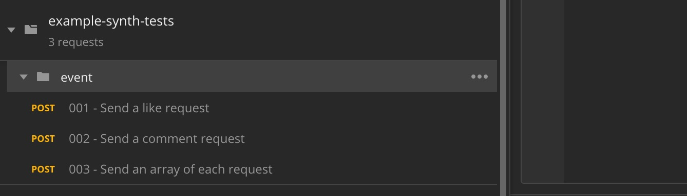
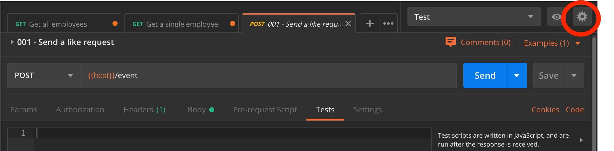
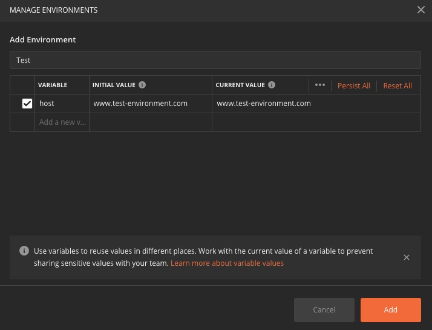
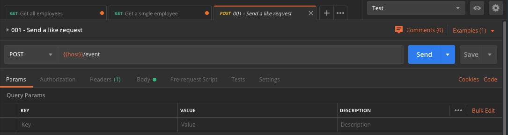
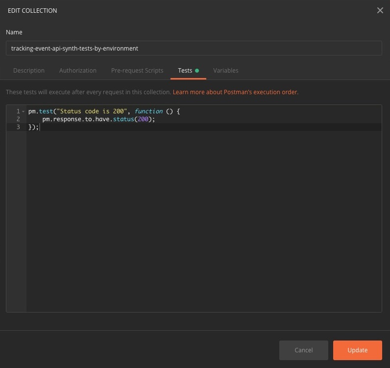
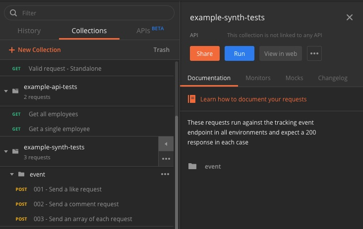
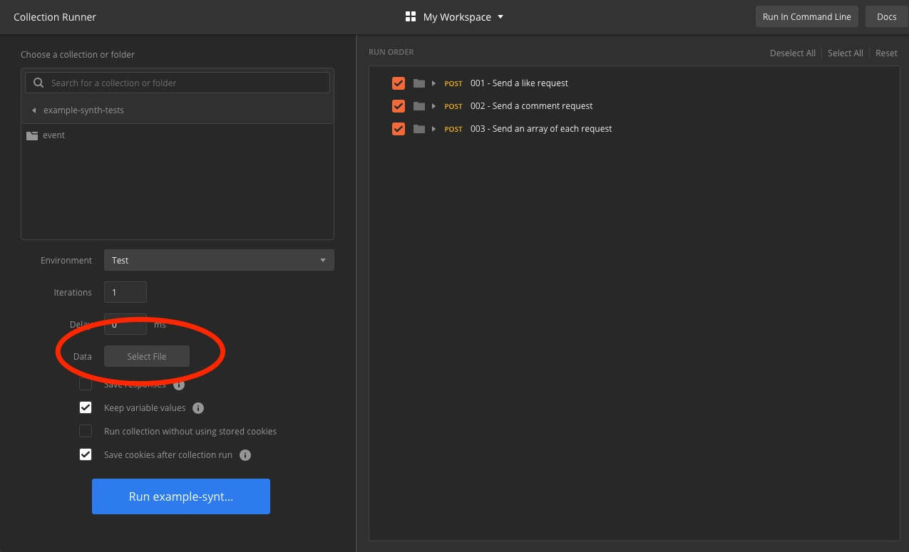
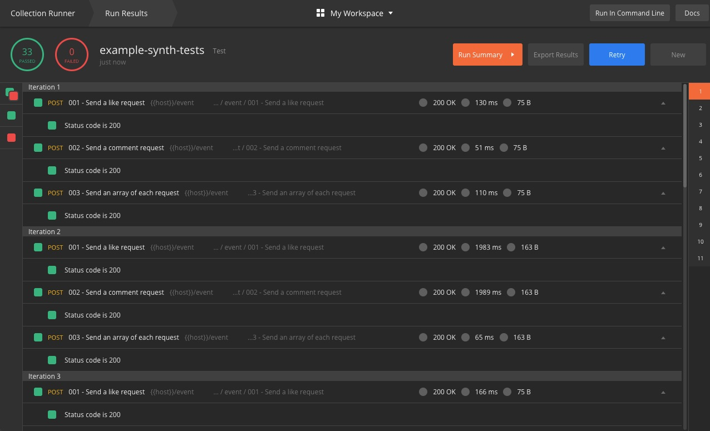
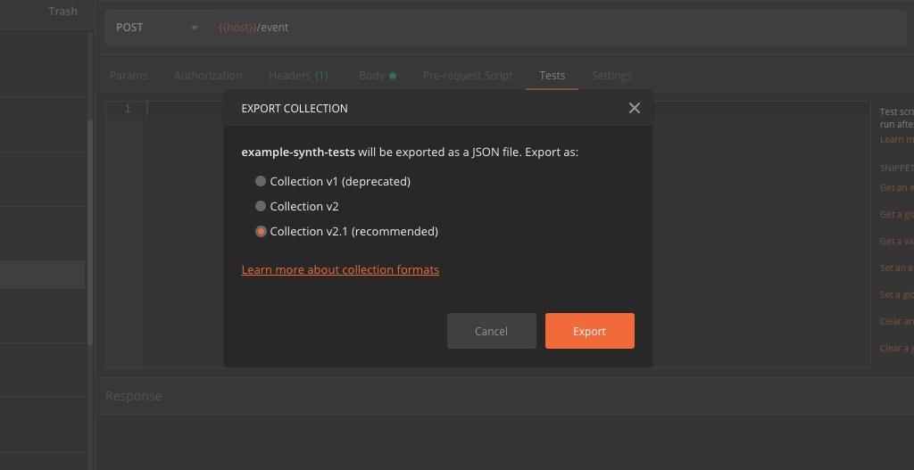
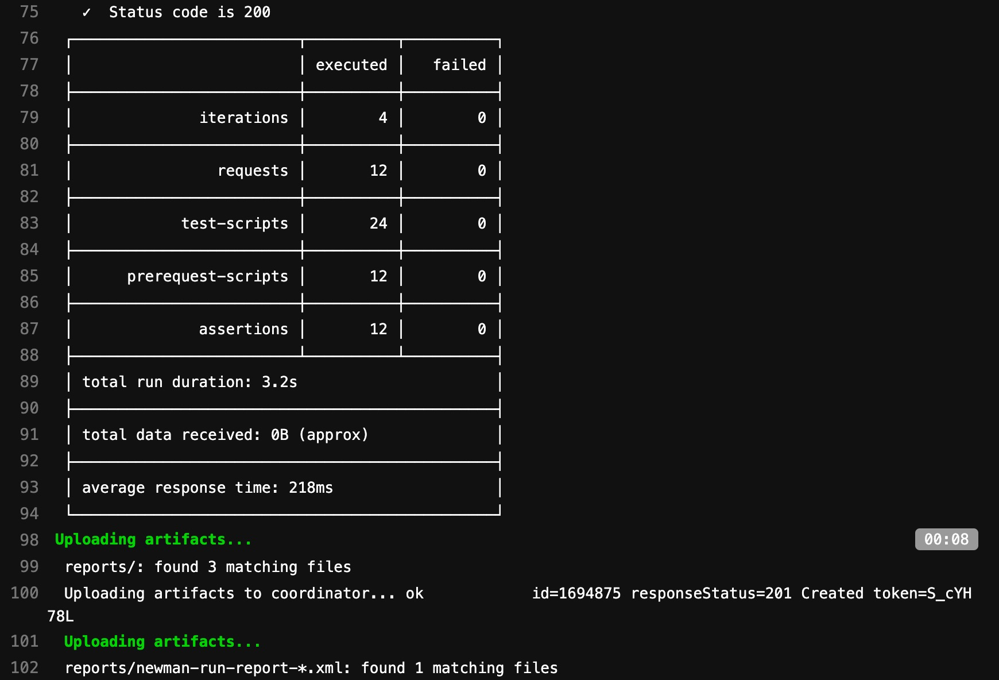

Whenever I have to test API endpoints Postman is always my first port of call. I start building up collections of different types of requests and verifying the correct response is returned in each case.

The next step is usually to consider how to automate these checks. In the past I've used different test frameworks, rest clients and a variety of coding languages for this task.

However after doing some research and in particular looking up some of Danny Dainton's excellent <a href="https://github.com/DannyDainton/All-Things-Postman">guides</a>, I realised it’s much simpler to create the tests in Postman and run these directly as part of the CI/CD pipeline.<br/>
No additional test framework, and minimal amount of code ( _javascript_ ) needed. Here’s how to do it!

## Create a collection

Firstly use Postman to start building up a collection of requests for the new endpoint:


## Add Environment Variables

Once you have a collection of requests built up you may want to run these against different environments. Add some variables for these by clicking on the gear icon on the top right hand corner:

Click __Add__ to create a new variable:

After you have added all the environments you can access them from each request by replacing the base url with the variable you just created:


## Create some tests

Let's create a simple test in javascript to check a status code of 200 is returned from the endpoint:
```javascript
pm.test("Status code is 200", function () {
    pm.response.to.have.status(200);
});
```

Edit the collection and add it to the __Tests__ section:


## Run the tests

Let's try run the tests now. Click on the play icon beside the collection then click __Run__:


This launches Postman's collection runner. From here you can select which environment and the number of iterations you wish to run.<br>
To iterate through a number of different environments let's create a JSON file with them listed:
```json
[{
  "host": "https://test_environment_1.com"
}, {
  "host": "https://staging_environment.com"
}, {
  "host": "https://integration_environment.com"
}, {
  "host": "https://production_environment.com"
}]
```
<small><i>all_environments.json</i></small><br>
Then click on the __Data - Select File__ button and choose the JSON file you just created:


After you run the tests here a report of the results is generated:


## Export your collection

Export your Postman collection as a JSON file (I usually go with the recommended 2.1 version):


## Create a project

Now we can run this collection as a test stage in the CI/CD pipeline. I created <a href="https://github.com/shcarroll/postman-newman-gitlab">this</a> example project on GitHub to show how it's wired together.

## Using Newman to run your tests

Newman is a command-line collection runner for Postman. It allows you to run and test a Postman collection directly from the command-line. Add __newman__ and __newman-reporter-html__ to the package.json file then call the runner in the scripts section.<br>
```json
{
  "name": "postman-newman-gitlab",
  "version": "1.0.0",
  "dependencies": {
    "newman-reporter-html": "^1.0.1",
    "newman": "^4.0.2"
  },
  "devDependencies": {
    "mkdirp": "^0.5.1",
    "npm": "^6.4.0",
    "rimraf": "^2.6.2"
  },
  "scripts": {
    "clean": "rimraf reports/; mkdirp reports/",
    "test": "newman run collections/example-synth-tests.json -d envs/all_environments.json -n 4 --insecure --reporters cli,html,junit --reporter-junit-export reports/ --reporter-html-export reports/"
  }
}
```
<small><i>package.json</i></small><br>
This is the important line from that file where the magic happens:
```json
    "test": "newman run collections/example-synth-tests.json -d envs/all_environments.json -n 4 --insecure --reporters cli,html,junit --reporter-junit-export reports/ --reporter-html-export reports/"
```
In this case we are running Newman with the following configuration options:
* ```collections/example-synth-tests.json```<br>
Running the example-synth-json test collection we exported earlier.

* ```-d envs/all_environments.json```<br>
Running the tests against all environments we listed in the JSON file above.

* ```-n 4```<br>
Specifies the number of times the collection will be run when used in conjunction with our all_environments data file.

* ```--insecure```<br>
Disables SSL verification checks and allows self-signed SSL certificates.

* ```--reporters cli,html,junit```<br>
Specifies the format of the reporter output.

* ```--reporter-junit-export reports/```<br>
Specifies the options for the reporter format declared above.

The full list of usage instructions for Newman is available from Github <a href="https://github.com/postmanlabs/newman">here</a>.

Then call this script from a test stage in the gitlab-ci.yml file:
```yaml
stages:
  - Synthetic Tests

synthetic-tests:
  stage: Synthetic Tests
  image: node:latest
  script:
    - npm i
    - npm run clean
    - npm test
  artifacts:
    when: always
    expire_in: 1 week
    reports:
      junit: reports/newman-run-report-*.xml
    paths:
      - reports/
```
<small><i>gitlab-ci.yml</i></small><br>
## See the results!

Newman reporter outputs the test results which are available once the pipeline completes on GitLab:


As you can see it's really simple to automate your API tests this way using Postman and Newman together. Feel free to clone my repo from Github and use it for your own tests.<br>

Thank you for reading, be sure to get in touch if you've any questions!
